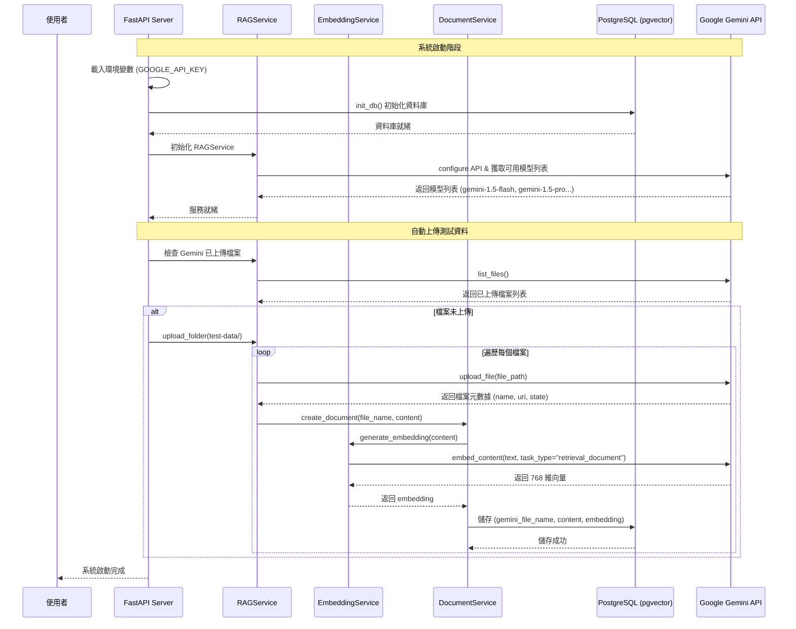
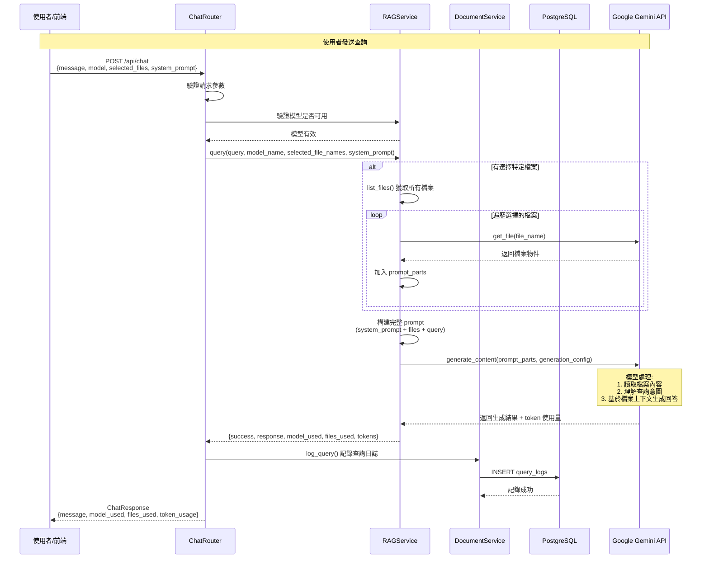
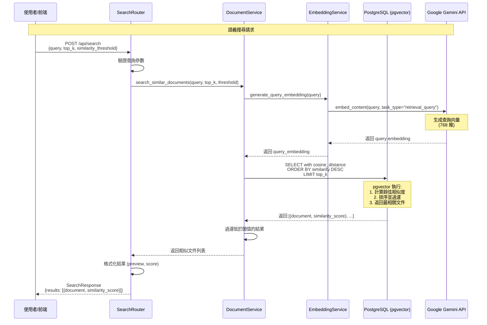
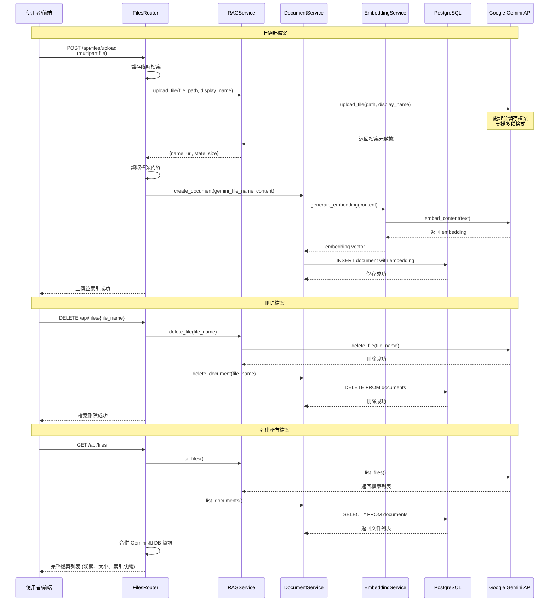
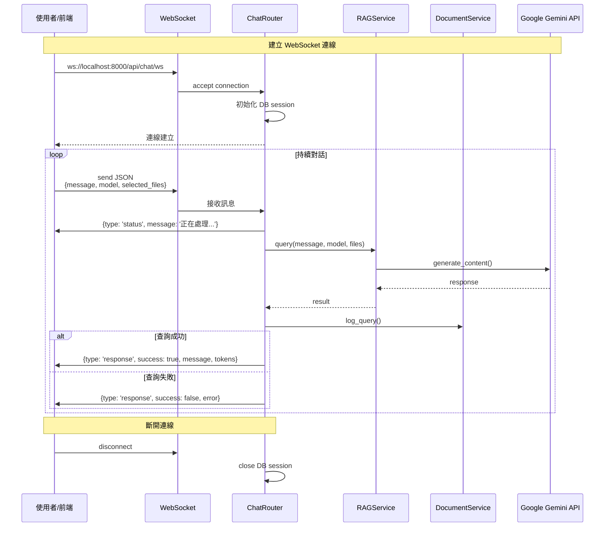
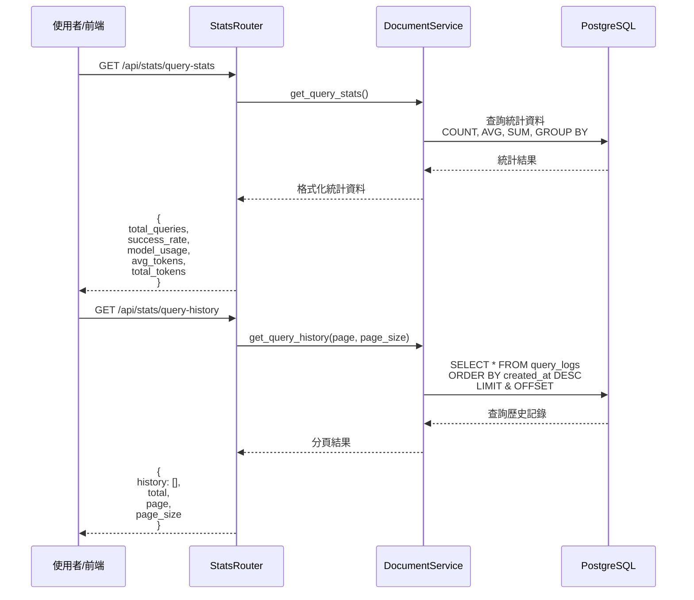

# RAG 系統時序圖

## 1. 系統啟動與文件上傳流程



## 2. 聊天查詢流程 (使用檔案上下文)



## 3. 語義搜尋流程



## 4. 文件管理流程



## 5. WebSocket 即時聊天流程



## 6. 統計資料流程



## 系統架構重點

### 核心組件

1. **RAGService**: 管理與 Google Gemini API 的互動
   - 模型管理與驗證
   - 檔案上傳/刪除
   - 生成回答 (基於檔案上下文)

2. **EmbeddingService**: 生成與管理向量嵌入
   - 文件向量化 (task_type: retrieval_document)
   - 查詢向量化 (task_type: retrieval_query)
   - 使用 Gemini text-embedding-004 模型

3. **DocumentService**: 文件與查詢管理
   - 文件 CRUD 操作
   - 向量相似度搜尋 (pgvector)
   - 查詢日誌記錄

4. **PostgreSQL with pgvector**: 向量資料庫
   - 儲存文件內容與 768 維向量
   - 高效餘弦相似度搜尋
   - 查詢統計與歷史記錄

### 資料流

```
使用者查詢 → API Router → RAGService → Gemini API
                ↓
           DocumentService → EmbeddingService → Gemini Embedding API
                ↓
           PostgreSQL (pgvector)
```

### 特色功能

- **多模型支援**: 動態載入可用的 Gemini 模型
- **檔案選擇**: 可指定特定檔案作為上下文
- **自訂系統提示**: 彈性控制回答風格
- **語義搜尋**: 基於向量相似度的智慧搜尋
- **使用統計**: Token 使用量、查詢成功率追蹤
- **WebSocket 支援**: 即時聊天互動
